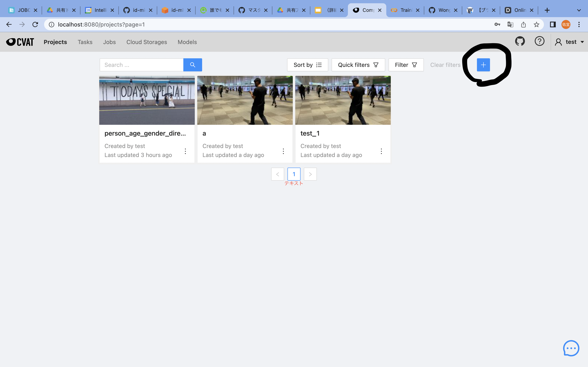
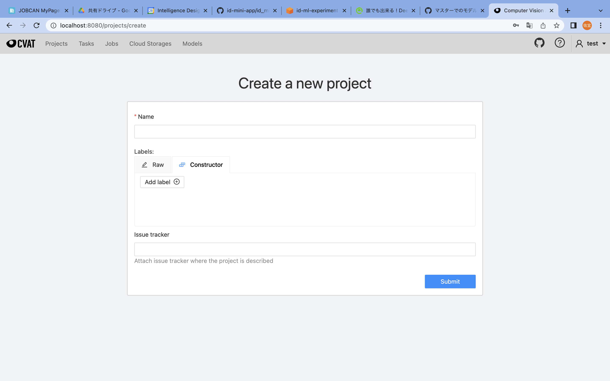
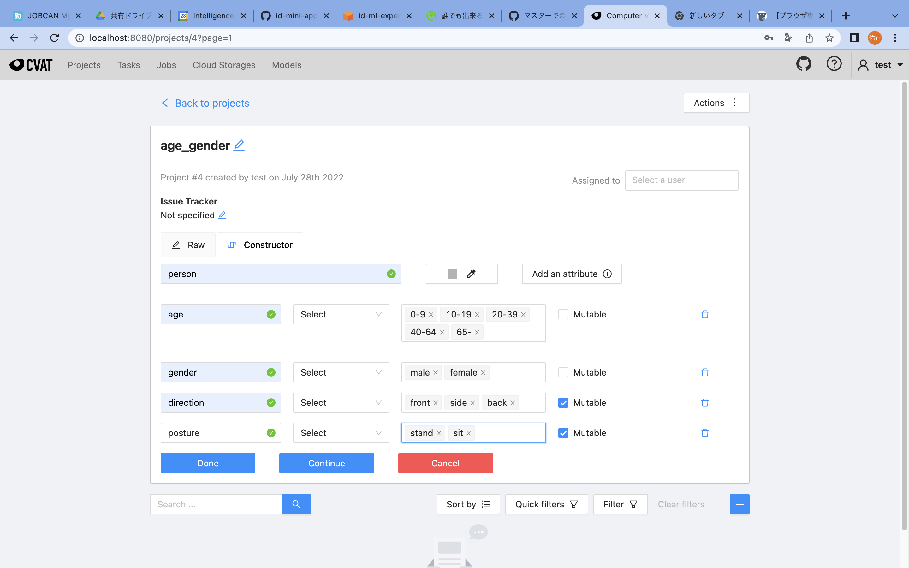

## CVATの使い方マニュアル

### 1.新しいプロジェクトを作る
 
新しくプロジェクトを作る際は、右上の ＋ ボタンをおし、create new projectを押下します。

 
その後 上記のような画面が出てくるので、プロジェクト名を記入し、LabelsのConstructorというタブを開き、Labelname(person,carなど)を記入します。
属性(personの場合でいうと性別や年齢)を追加したい時は「Add an attribute」を押下し、「name」に属性名を入れ、「Attribute values」に属性の値を入れます(Attributeが人間の場合nameがageでAttribute valuesが0-9 10-19 20-39 40-64 65- というような値)
姿勢や体の移り方の向きなど途中で値が変化する可能性があるlabelには右にある「Mutable」にチェックマークを入れておいてください。
全て記入後にDoneを押してください。
その後、submitを押下すると右上にopen projectが出るのでそれを押下してください。

ラベルの完成図はこんな感じになっていると思います(イメージ)

### 2. 新しいjobを作る
また、＋マークがあるのでそれを押下します。
Nameにjob名を入れ、selectfileにzip化したフォルダを入れ、submitを押すとjobを作ることができます。
（jobを作る際の注意点：フォルダ直下に画像がないとエラーを吐きます。また、txtでアノテーションしたものも読み込みたい時は別途事前処理が必要になります。)

### 3.jobを開き、アノテーション作業をする

jobを開くとアノテーション作業が可能になります。
アノテーションを行うには左側、メニュー中央の長方形のアイコン、Draw new rectangleの上にカーソルを置き、ShapeもしくはTrackをクリックするとアノテーションが行えます。

- Shapeはアノテーション元の画像が連続していない時に使いやすいものです。
- Trackはアノテーション元の画像が連続した時系列になっていると使いやすいものになります。一つアノテーションを行うと次のフレームにもそのアノテーションの情報が残るので微調整するだけで完了するものになっています。
- trackを使った際に注意点としては、アノテーション対象が画面外に出て行った際や、見えなくなった際にはそのアノテーションフレームをクリックし、キーボードの「ｏ」を押すことでそれ以降のフレームにそのアノテーション情報を消すことができます。
- また、再度アノテーションを行い、特徴を入力した対象が現れた場合、新規のアノテーションと同じくフレームで囲い、キーボード「M」を押下し、最後にあわられたフレームともう一度現れたシーンのフレームをクリックし、再度「M」を押すことで二つの情報を合体させることができます。

右の画面でdetailを押すとlabelで設定したattributeが現れ、編集することができます。上記のような画面になります

途中で作業をセーブしたい場合は左上にあるSAVEアイコンをクリックすると作業内容が保存されます。
また、作業が完了し、アノテーション情報を出力したい際はMenuを押下し、Export task datasetを押します。
その後、フォーマットを選択肢（おそらくPascalVOC?)を選択し、save imagesをチェックし、Custom nameに任意の名前を入れ、okを押すとアノテーション情報と画像がzip化されダウンロードできます。

